<!--
*** Thanks for checking out the Best-README-Template. If you have a suggestion
*** that would make this better, please fork the repo and create a pull request
*** or simply open an issue with the tag "enhancement".
*** Thanks again! Now go create something AMAZING! :D
***
***
***
*** To avoid retyping too much info. Do a search and replace for the following:
*** github_username, repo_name, twitter_handle, email, project_title, project_description
-->


<!-- PROJECT SHIELDS -->
<!--
*** I'm using markdown "reference style" links for readability.
*** Reference links are enclosed in brackets [ ] instead of parentheses ( ).
*** See the bottom of this document for the declaration of the reference variables
*** for contributors-url, forks-url, etc. This is an optional, concise syntax you may use.
*** https://www.markdownguide.org/basic-syntax/#reference-style-links
-->


<!-- PROJECT LOGO -->


<!-- TABLE OF CONTENTS -->
<details open="open">
  <summary><h2 style="display: inline-block">Tabla de Contenidos</h2></summary>
  <ol>
    <li>
      <a href="#Sobre-el-Proyecto">Sobre el Proyecto</a>
      <ul>
        <li><a href="#Construido-Con">Programado</a></li>
      </ul>
    </li>
    <li>
      <a href="#getting-started">Inicializando</a>
      <ul>
        <li><a href="#prerequisitos">Prerequisitos</a></li>
        <li><a href="#Instalacion">Instalacion</a></li>
      </ul>
    </li>
    <li><a href="#uso">Uso</a></li>
    <li><a href="#contacto">Contacto</a></li>
    <li><a href="#acknowledgements">Agradecimientos</a></li>
  </ol>
</details>


<!-- ABOUT THE PROJECT -->
## Sobre el Proyecto
Proyecto de diseño de pagina con scroll y login.
* Scroll ubicado en la ruta ```/```
* Login ubicado en la ruta ```/login```

### Prerequisitos
* Instalar PHP y [Laravel](https://laravel.com/)
* [Instrucciones de como instalar en Blackboard](https://docs.google.com/document/d/1uRJtdrB-R47UZ-lCQ_U6D5TzM5Ks2g5dgLSSNG4xMIo/edit?usp=sharing)
* Crear una base de datos con nombre proyectophp
* Verificar que en el directorio de instalacion de php, exactamente en ```/tools/php80``` el ```php.ini``` tenga la linea ```'extension=pdo_mysql'``` y la linea ```'extension=gd'``` Sin ";"
### Instalacion

1. Clone the repo
   ```sh
   git clone https://github.com/Ckeshua/Tarea1.git
   ```
* 2. Abrir powershell y luego dirigirse a la ubicacion del proyecto e ingresar ```php artisan migrate``` y ```php artisan migrate:fresh --seed```
* 3. Iniciar servidor con ```php artisan serve```

### Uso
* Para hacer uso de esta pagina siga estos simples pasos:
* 1. Dirijase a el dropdown de login y ingrese sus credenciales
[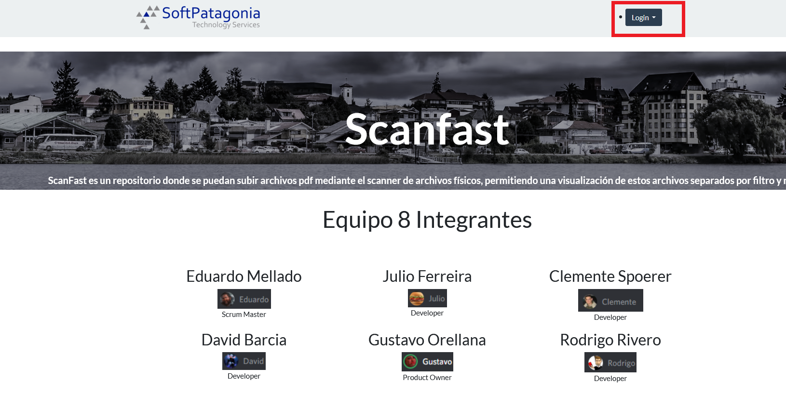](primerproyecto/storage/ScreenshotsProyect/paginaprinc.png)
* 2. Luego ingrese a "archivos" para ver el repositorio de archivos pdf que existen actualmente
[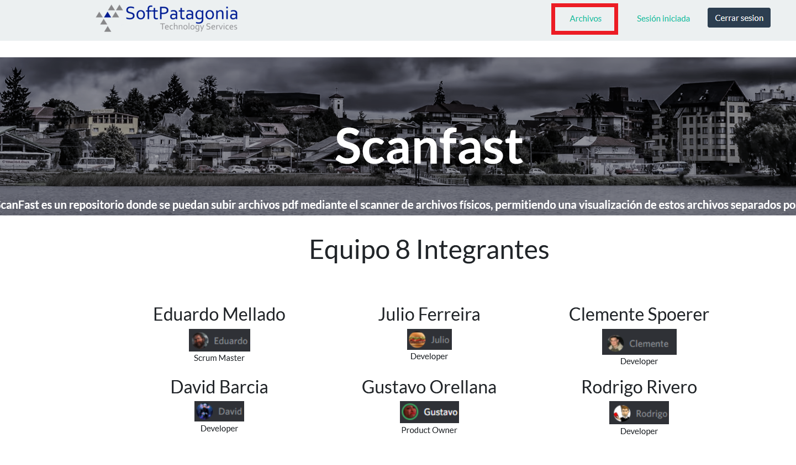](primerproyecto/storage/ScreenshotsProyect/paginaprinc2.png)
* 3. Para subir un documento presione el boton subir
[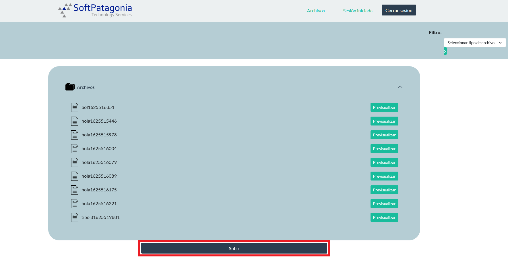](primerproyecto/storage/ScreenshotsProyect/rep_archivos.png)
* 4. Con la seleccion de opciones de nivel de archivo puede seleccionar quienes podran ver los archivos
[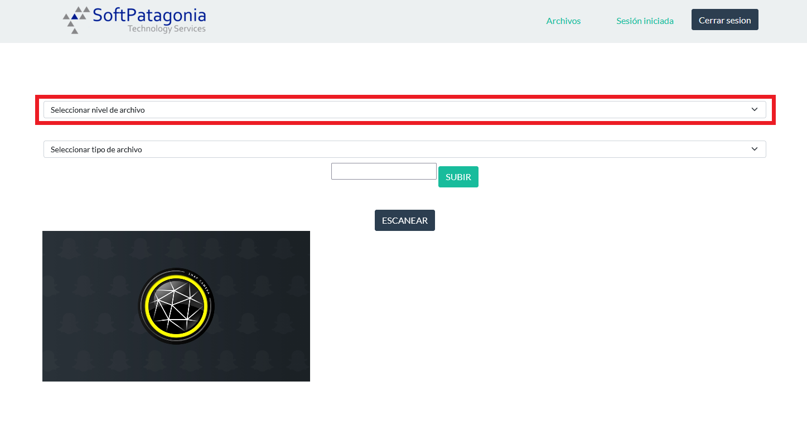](primerproyecto/storage/ScreenshotsProyect/Escanear1.png)
* 5. Con esta seleccion de opciones puede seleccionar que tipo de archivo subirá
[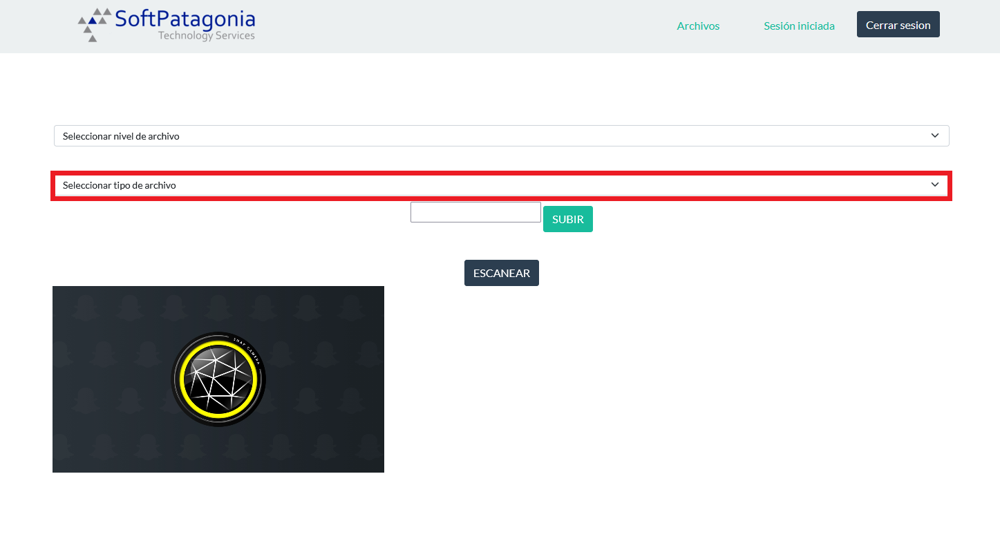](primerproyecto/storage/ScreenshotsProyect/Escanear2.png)
* 6. En este cuadro puede ingresar el nombre que tendra el archivo (nombres repetidos son aceptados)
[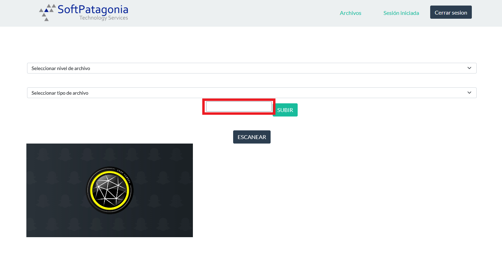](primerproyecto/storage/ScreenshotsProyect/Escanear3.png)
* 7. Con este boton guarda lo que este mostrando la camara en ese momento
[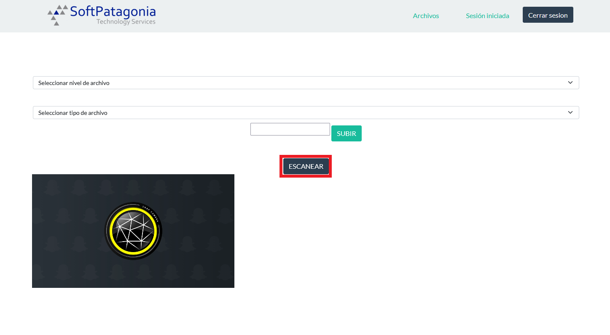](primerproyecto/storage/ScreenshotsProyect/Escanear4.png)
* 8. Aqui se mostraran las imagenes que hayan sido escaneadas 
[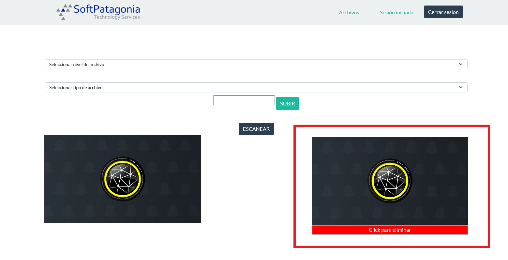](primerproyecto/storage/ScreenshotsProyect/Escanear5.png)
* 9. Puede borrar la imagen escaneada con este boton
[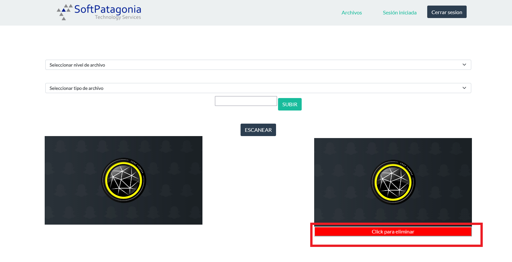](primerproyecto/storage/ScreenshotsProyect/Escanear6.png)
* 10. Al darle a este boton procede a subir el PDF
[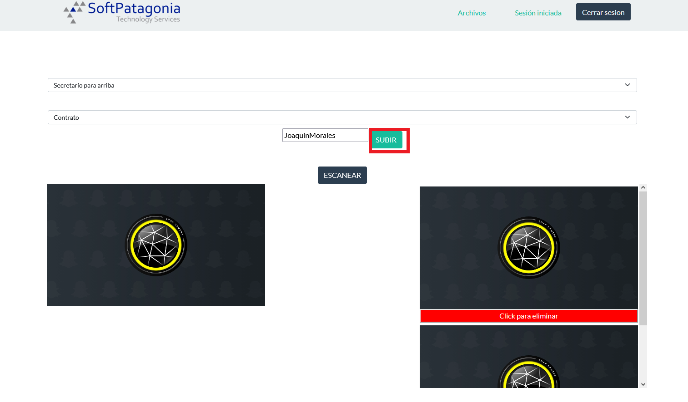](primerproyecto/storage/ScreenshotsProyect/Escanear7.png)
* 11. Aqui ya se muestra el archivo recien subido
[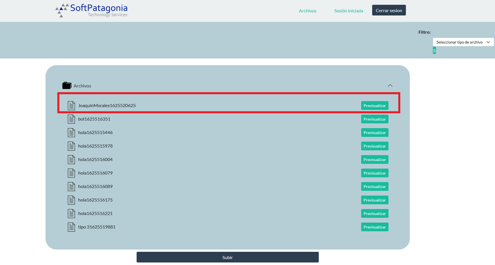](primerproyecto/storage/ScreenshotsProyect/rep_arch_subido1.png)
* 12. Puede usar el filtro para mostrar solo los PDF que son de alguna clase
[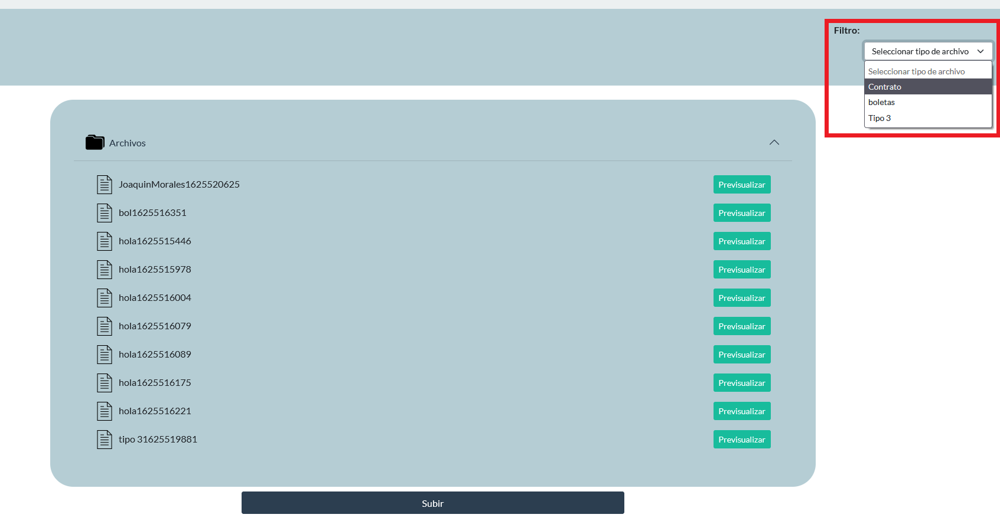](primerproyecto/storage/ScreenshotsProyect/rep_arch_subido2.png)
* 13. Luego de seleccionar una opcion debe apretar el boton que se muestra en la siguiente foto
[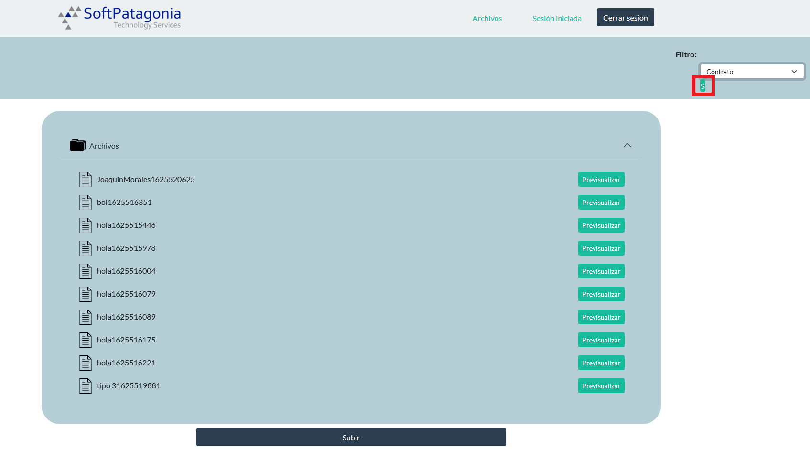](primerproyecto/storage/ScreenshotsProyect/rep_arch_subido3.png)
* 14. Aqui ya se muestran todos los documentos filtrados
[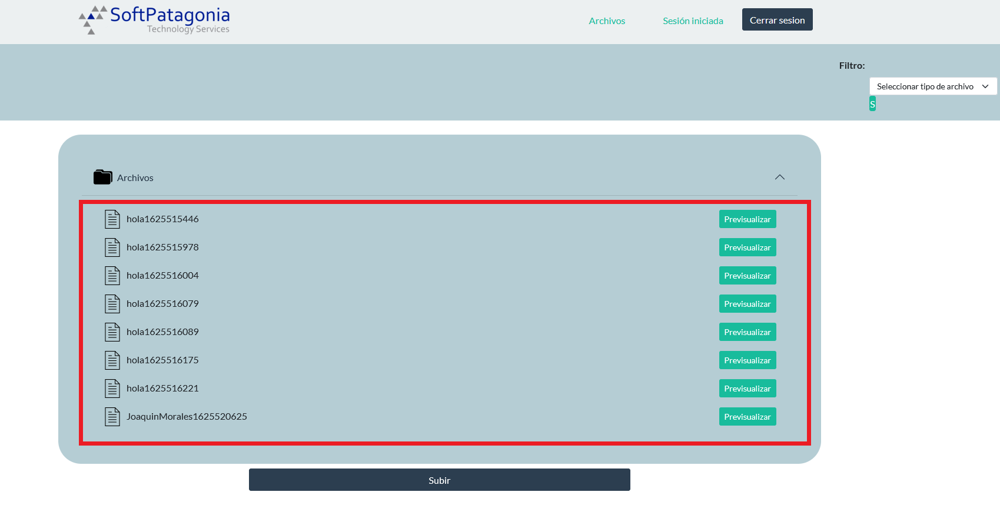](primerproyecto/storage/ScreenshotsProyect/rep_arch_subido4.png)
### Construido Con

* [Boostrap](https://getbootstrap.com/)
* [Laravel](https://laravel.com/)


<!-- Contacto -->
## Contacto

* David Barcia [Developer](https://github.com/Zailarx5)
* Julio Ferreira [Developer](https://github.com/JulioFe)
* Eduardo Mellado	[Scrum Master](https://github.com/Ckeshua)
* Gustavo Orellana [Product Owner](https://github.com/Gaos700)
* Rodrigo Rivero [Developer](https://github.com/Riverozky)
* Clemente Spoerer [Developer](https://github.com/alomex21)
* Project Link: [https://github.com/Ckeshua/Tarea1](https://github.com/Ckeshua/Tarea1)


<!-- MARKDOWN LINKS & IMAGES -->
<!-- https://www.markdownguide.org/basic-syntax/#reference-style-links -->
[contributors-shield]: https://img.shields.io/github/contributors/Ckeshua/Tarea1.svg?style=for-the-badge
[contributors-url]: https://github.com/Ckeshua/Tarea1/graphs/contributors
[forks-shield]: https://img.shields.io/github/forks/Ckeshua/Tarea1.svg?style=for-the-badge
[forks-url]: https://github.com/Ckeshua/Tarea1/network/members
[stars-shield]: https://img.shields.io/github/stars/Ckeshua/Tarea1.svg?style=for-the-badge
[stars-url]: https://github.com/Ckeshua/Tarea1/stargazers
[issues-shield]: https://img.shields.io/github/issues/Ckeshua/Tarea1.svg?style=for-the-badge
[issues-url]: https://github.com/Ckeshua/Tarea1/issues
[license-shield]: https://img.shields.io/github/license/Ckeshua/Tarea1.svg?style=for-the-badge
[license-url]: https://github.com/Ckeshua/Tarea1/blob/master/LICENSE.txt
